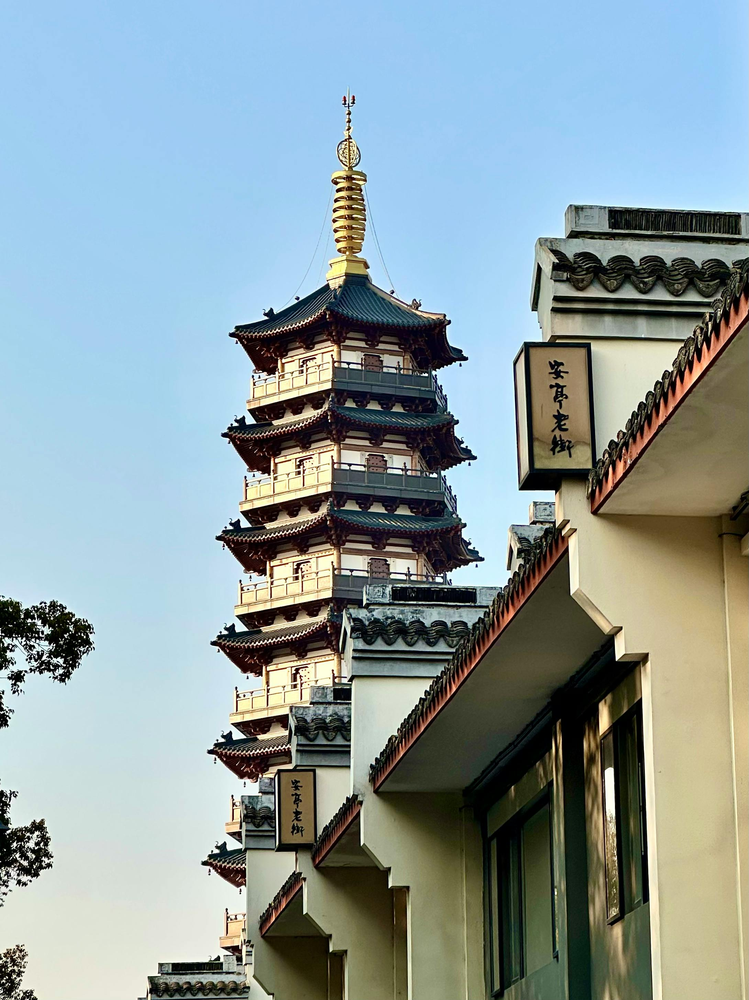
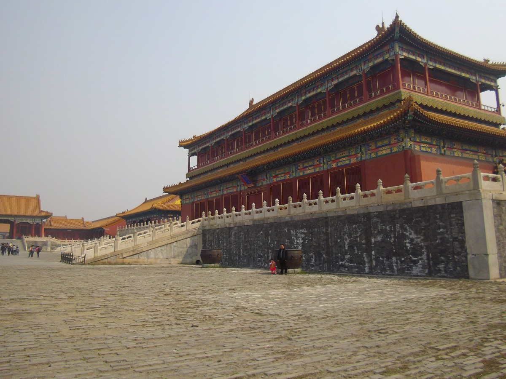
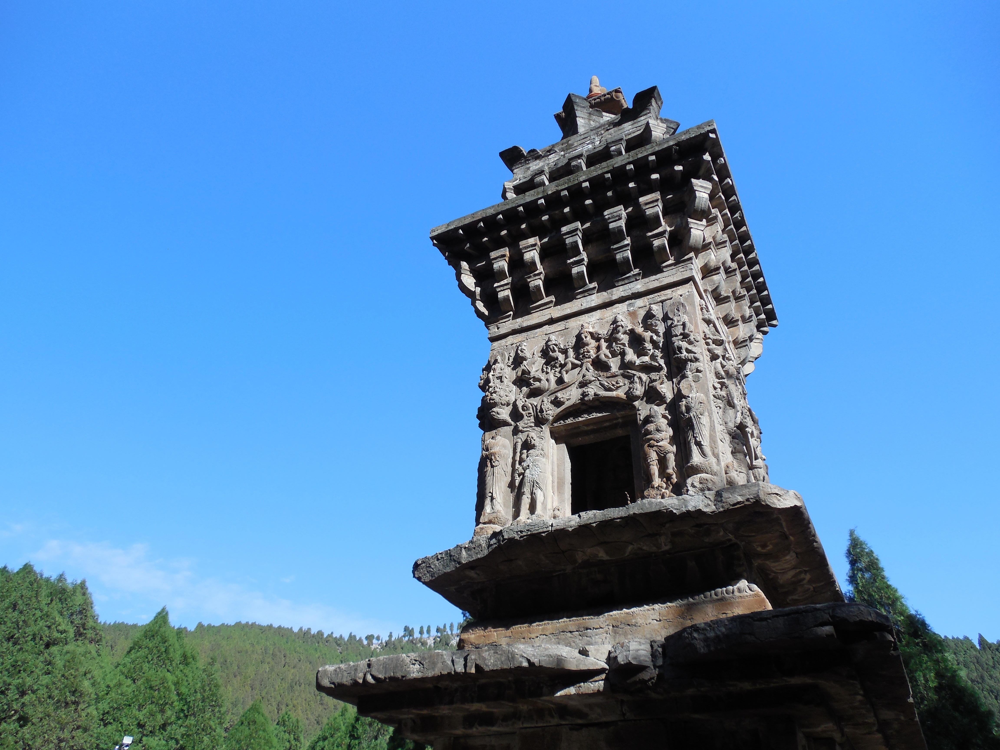

# 文化遗产保护与利用

    
    

    

        <h1>文化遗产保护与利用</h1>
        
Cultural Heritage Conservation and Utilization

        
系统介绍文化遗产的概念界定、价值体系、保护原则与实践方法

        

            7大章节
            32个小节
            20+案例
        

    

---

## 章节导航

    

        
        01
        
&#127983;

    

    

        <h3>第一章 · 文化遗产概述</h3>
        
文化遗产的基本概念、多元价值体系、国际国内保护制度的发展历程与时代背景。

        

            5个小节
            2个案例
        

    

    

        
        02
        
&#9200;

    

    

        <h3>第二章 · 保护发展历程</h3>
        
系统梳理国际与中国文化遗产保护的发展脉络，从《威尼斯宪章》到《西安宣言》。

        

            4个小节
            2个案例
        

    

    

        
        03
        
&#127960;

    

    

        <h3>第三章 · 聚落文化遗产</h3>
        
聚焦古村落、历史文化城镇、历史街区等聚落形态的文化遗产整体性保护。

        

            5个小节
            3个案例
        

    

    

        
        04
        
&#127983;

    

    

        <h3>第四章 · 建筑文化遗产</h3>
        
文物建筑、历史建筑、工业遗产等建筑类遗产的保护技术与活化利用方法。

        

            5个小节
            3个案例
        

    

    

        
        05
        
&#127981;

    

    

        <h3>第五章 · 产业文化遗产</h3>
        
农业遗产、工业遗产、手工业遗产、交通水利遗产等产业遗产的分类与保护方法。

        

            6个小节
            3个案例
        

    

    

        
        06
        
&#127994;

    

    

        <h3>第六章 · 可移动文物</h3>
        
可移动文物的概念界定、分类体系、价值评估、保护技术及展示传播策略。

        

            6个小节
            3个案例
        

    

    

        
        07
        
&#127917;

    

    

        <h3>第七章 · 非物质文化遗产</h3>
        
传统技艺、民俗表演、民间艺术等非遗的认定标准、保护原则与传承机制。

        

            5个小节
            3个案例
        

    

---

## 课程特点

| 特点 | 说明 |
|------|------|
| &#127983; **系统性** | 从理论到实践，从概念到方法，构建完整的文化遗产保护知识体系 |
| &#127758; **国际视野** | 系统介绍国际公约与UNESCO框架，对标国际标准与先进经验 |
| &#127464;&#127475; **中国特色** | 深入分析中国文化遗产保护的制度演进与本土化实践 |
| &#128247; **案例丰富** | 涵盖20余个国内外典型案例，提供可借鉴的保护经验 |
| &#9851; **活化利用** | 关注文化遗产的合理利用与可持续发展 |

---

## 典型案例

    

        
    

    

        <h4>西安城墙整体保护</h4>
        
中国现存规模最大、保存最完整的古代城垣建筑

        聚落案例
    

    

        
    

    

        <h4>故宫博物院的保护与利用</h4>
        
世界文化遗产保护与活化利用的典范

        建筑案例
    

    

        
    

    

        <h4>景德镇陶瓷技艺传承</h4>
        
传统手工技艺的数字化保护与传承创新

        非遗案例
    

    

        
    

    

        <h4>北京798艺术区更新</h4>
        
工业遗产保护与文创产业发展的有机结合

        产业案例
    

[查看全部案例](cases/)

---

## 联系方式

    
&#128231;

    

        <h3>华南理工大学设计学院</h3>
        
联系邮箱：<strong>sdtshi@scut.edu.cn</strong>

        
欢迎对文化遗产保护感兴趣的同学和学者交流探讨

    

