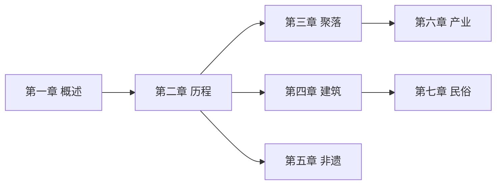

# 章节概览

本课程共分为七个章节，系统介绍文化遗产保护与利用的理论与实践。

---

## 章节总览

| 章节 | 主题 | 小节数 | 案例数 |
|------|------|--------|--------|
| 第一章 | 文化遗产概述 | 5 | 2 |
| 第二章 | 保护发展历程 | 4 | 2 |
| 第三章 | 聚落文化遗产 | 5 | 3 |
| 第四章 | 建筑文化遗产 | 5 | 3 |
| 第五章 | 非物质文化遗产 | 5 | 3 |
| 第六章 | 产业文化遗产 | 6 | 3 |
| 第七章 | 民俗文物 | 6 | 3 |

---

## 学习路径

---

## 快速导航

[第一章 文化遗产概述](chapters/chapter1/)
: 概念界定、价值体系、国际保护体系、中国保护制度

[第二章 保护发展历程](chapters/chapter2/)
: 国际发展、中国发展、基本原则、主要方法

[第三章 聚落文化遗产](chapters/chapter3/)
: 认知基础、保护原则、实践、更新利用、制度保障

[第四章 建筑文化遗产](chapters/chapter4/)
: 概念类型、保护技术、管理、活化利用、城市更新

[第五章 非物质文化遗产](chapters/chapter5/)
: 概念特征、保护原则、措施、传承发展、数字化保护

[第六章 产业文化遗产](chapters/chapter6/)
: 概述、农业遗产、工业遗产、手工业遗产、交通水利、商业服务

[第七章 民俗文物](chapters/chapter7/)
: 概念类型、保护利用、分类特征、调查认定、保护技术、展示传播

